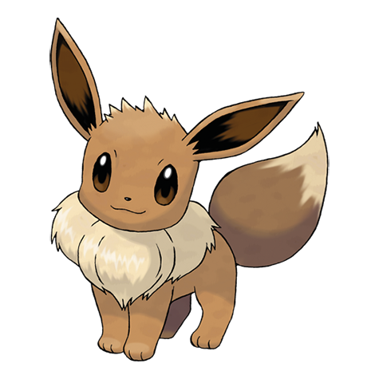

# Project <!-- omit in toc -->

# Table of content <!-- omit in toc -->

- [1. Installation](#1-installation)
- [2. Bilder](#2-bilder)
- [3. Notater til meg selv](#3-notater-til-meg-selv)

# 1. Installation

```js
const hello = "world";
```

```bash
npm install
```

# 2. Bilder

Alle bilder av de forskjellige pokémon er hentet fra https://www.pokemon.com/us/pokedex.



[Pokemon-logo](https://www.pngegg.com/en/png-wpzwe)


[Pokemon-placeholder-bilde](https://www.google.com/search?sca_esv=584551767&rlz=1C5CHFA_enNO1019NO1020&hl=no&sxsrf=AM9HkKm7KbqGKYbwRQEagmyG9EiGeVzcxg:1700652464270&q=pokemon+question+mark+png&tbm=isch&source=lnms&sa=X&ved=2ahUKEwjgn5OQwNeCAxVtFBAIHX3OB2MQ0pQJegQICxAB&biw=1440&bih=790&dpr=2#imgrc=AWkiklilCU9zEM)


Pokemon trenere: [Ash](https://www.pngwing.com/en/free-png-mtzss) og [Gary](https://www.pngwing.com/en/free-png-tmrpw)

 

Navigasjons-ikonene er laget med DALL-E.

  

# 3. Notater til meg selv

Kom med forslag til pokémon info som kan legges inn

Legg ved bilder av alle pokémon

Legg ved bilder av ikoner jeg har laget med DALL.E


Vise pokemonkort på allPokemon.
Kjør listen én gang. Hvis den allerede er kjørt, ikke POST igjen, bruk GET.

Vise trenere på allPokemon.
Hardkode trenere. Gjør samme som på pokemon kort.

Hent alle trenere i "Velg trener" og velg hvilken trener til hvilken pokemon.
GET trenere jeg har laget, og vis navn i listen.

Når man lagrer pokemon => PUT pokemon og trener

Gå inn på trener => Ser hvilke pokemon den trener har
(Ny side)